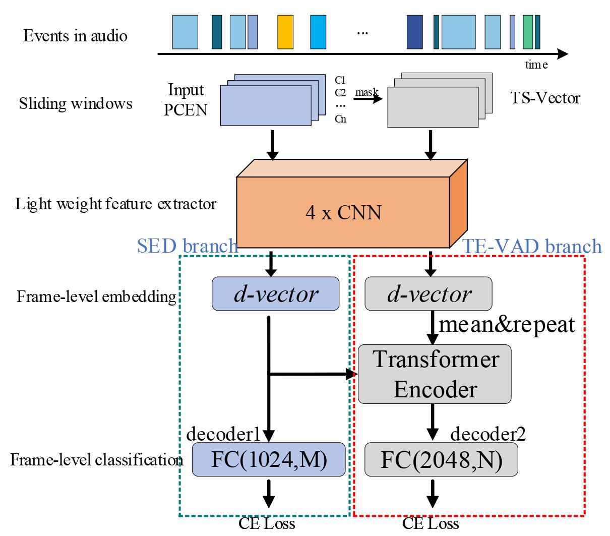
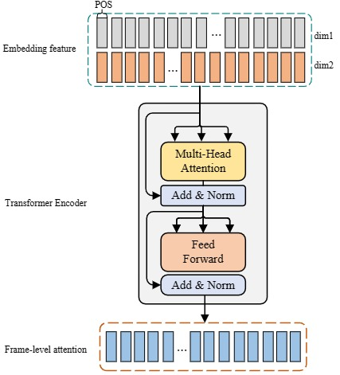
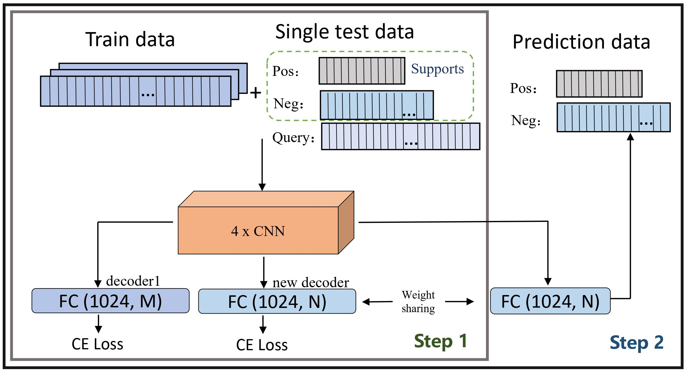
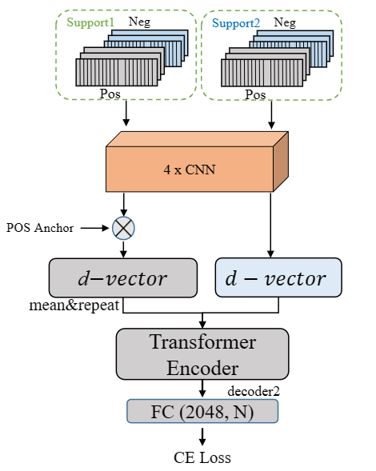

<!--
 * @Descripttion: 
 * @version: 
 * @Author: gwyan
 * @Date: 2023-12-20 14:37:31
 * @LastEditors: gwyan
 * @LastEditTime: 2023-12-25 10:28:13
-->

## DCASE2023 task5 code
This is our submision code in DCASE2022-2023 task5.  
In the 2022 Task5 challenge, we propose an adaptive frame-level embedding learning learning network, which performs audio detection on each frame of the sliding window by adaptively, in conjunction with a supervision loss based on the support set. Finally we got the 1st rank in the Task5. Furthermore, in the 2023 challenge, we further propose the multitask frame-level embedding learning framework, which makes feature extractor and classifier more robust and powerful. 

The framework of train/finetune stage is shown as follows:
* ### Training Framework      
    |  training framework         |  TF-Encoder                          |
    |-------------------------------|------------------------------|
    |    |  |                         

* ### Finetuning Framework                               
    |  SED branch          |  TE-VAD branch                           |
    |-------------------------------|------------------------------|
    |    |  |

#### How to run it?
Please set the true development path or other hyperparameters on config.yaml file. Then you can select option (feature/train/finetune/metric) by the run.sh. For example.  

feature extraction  

    chmod 755 run.sh 
    ./run.sh feature

##### NOTE
As our paper describe, our methods have a lot of hyper-parameter, we do not spend a lot of time to find the best hyper-parameters.  
We belive if you carefully choose the hyper-parameters, you can get better results than our paper. The validatation set is small, so the results will has a little different if you run many times.

Due to certain constraints, we are unable to release the full codebase. However, we encourage you to refer to our paper for details and believe that you will be able to replicate the work based on the information provided therein.

##### Reference
Our code are based following code.  
https://github.com/c4dm/dcase-few-shot-bioacoustic  
https://github.com/yangdongchao/DCASE2021Task5

##### Cite

